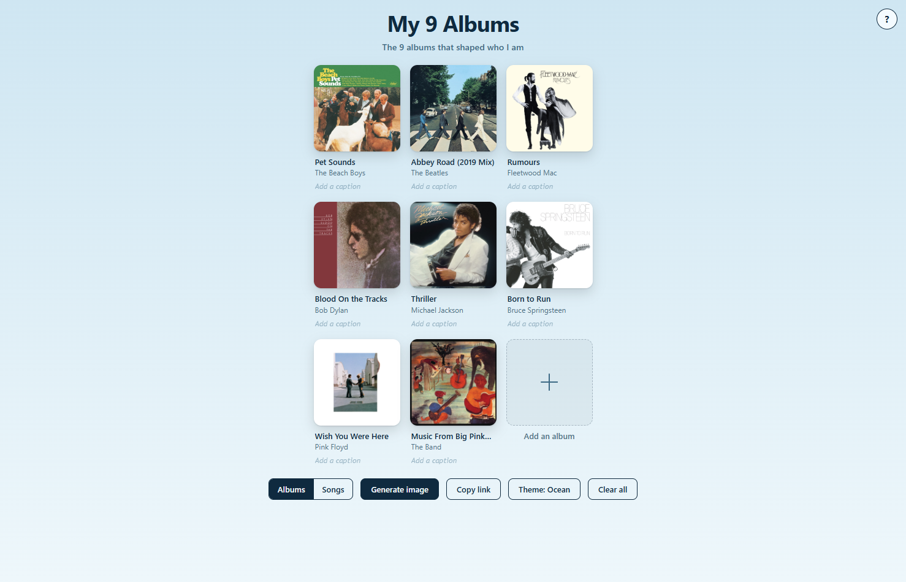
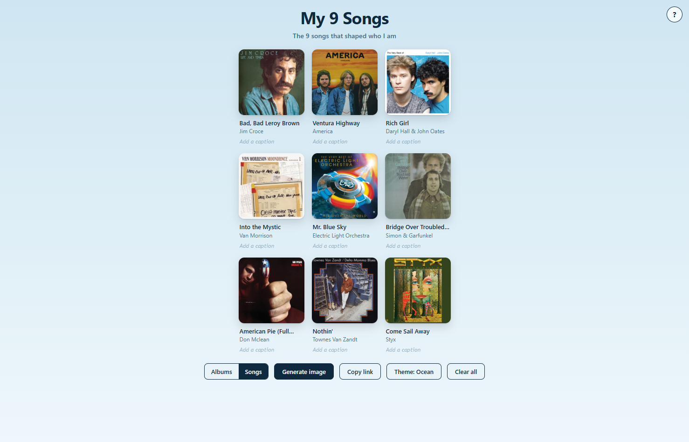
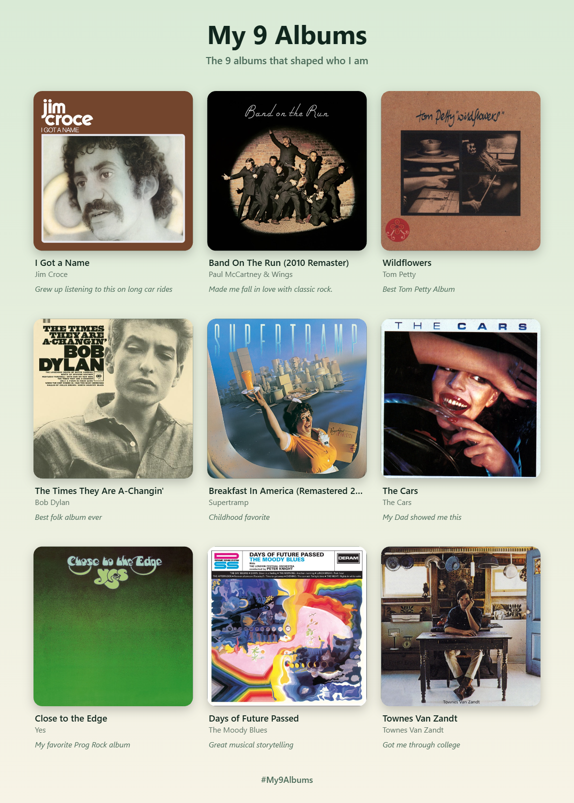

# My 9 Albums

**My 9 Albums** is a simple, interactive web app for creating a personal 3×3 collage of the albums or songs that mean the most to you.

Search for music, build your 9 picks, rearrange them, add your own captions, listen to 30-second previews, customize the theme, and share your finished collage with a link.

## Try It Out

You can try **My 9 Albums** here:

https://ssuttonn.github.io/My-9-Albums/

## Features

- **Albums & Songs modes** — Create a list of your 9 favorite albums or songs.
- **Music search** — Search by album, song, or artist.
- **30-second previews** — Listen to random track previews from selected albums.
- **Custom captions** — Add a short personal note underneath each pick.
- **Drag and drop** — Rearrange your 9 selections by dragging them into different positions.
- **Shareable links** — Copy a link containing your collage so someone else can view it.
- **Generate an image** — Export your finished 3×3 collage as a PNG.
- **Themes** — Cycle through different color themes.
- **Separate Albums/Songs lists** — Your album and song selections are kept separately.
- **Responsive design** — Works on desktop and mobile.
- **Keyboard accessible controls** — Buttons and grid items include keyboard/focus support.
- **No account required** — Everything works directly in the browser.

## Screenshots

<!-- Replace these placeholder paths with your actual screenshots. -->

### Albums

### Songs

### Sharing a collage

## How It Works

1. Choose **Albums** or **Songs**.
2. Click an empty `+` square.
3. Search for an album, song, or artist.
4. Select a result to add it to your collage.
5. Add a caption describing why that pick matters to you.
6. Drag the covers to rearrange them.
7. Use **Theme** to change the appearance.
8. Use **Generate image** to save your collage as a PNG.
9. Use **Copy link** to create a shareable version of your collage.

When someone opens a shared collage, it is displayed in a read-only view. They can choose **Save a copy** to bring the collage into their own browser.

## Running Locally

Because this is a static website, there is no build process.

You can simply open `index.html` in a browser.

For the best experience, you can also run it through a small local web server.

### Using VS Code

If you have the Live Server extension installed:

1. Open the project in VS Code.
2. Right-click `index.html`.
3. Select **Open with Live Server**.

## Music Data

Music search and preview data comes from Apple's **iTunes Search API**.

The app uses the API to retrieve:

- Album names
- Song names
- Artist names
- Album artwork
- Release information
- 30-second preview URLs when available

The app does not require an API key.

## Data & Privacy

There is no user account or backend database.

Your current collage and settings are stored in the browser using web storage. Shareable collages are encoded into the URL itself, allowing the recipient to view the collage without an account.

The app does not have its own server for storing user collections.

## License

This project is available for personal and educational use.

## AI Disclosure

AI tools were used as a development aid throughout this project. I designed the project and oversaw the development process and final result.
The readme was generated with AI.

---

Made with HTML, CSS, and JavaScript.
